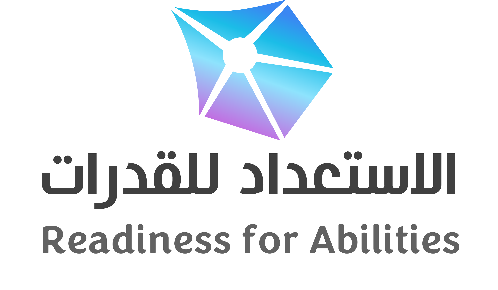

# 🔧 CSS and Images Fixed!

## 🐛 Issues Found and Fixed:

### 1. CSS Not Loading
**Problem:** `includes/header.php` line 14 had relative path:
```html
<link rel="stylesheet" href="assets/css/style.css">
```

**Fixed to absolute path:**
```html
<link rel="stylesheet" href="/assets/css/style.css">
```

### 2. Logo Image Not Loading
**Problem:** `includes/header.php` line 48 had relative path:
```html

```

**Fixed to absolute path:**
```html

```

### 3. Course Brochure Image Wrong Name
**Problem:** `front-page.php` was looking for `course-brochure.jpg`
**Fixed to correct filename:** `بروشور-دورة-القدرة-المعرفية-ج47.jpg`

---

## ✅ New ZIP File Created

**File:** `qudrat100-upload-FIXED.zip` (740 KB)
**Location:** `C:\Users\Chairi\wordpress\qudrat100-upload-FIXED.zip`

---

## 🚀 Upload Instructions

### Step 1: Remove Old Files (If Already Uploaded)
1. Login to Hostinger File Manager
2. Delete the old files:
   - Delete `includes/` folder from public_html
   - Delete theme folder from `wp-content/themes/custom-theme/`

### Step 2: Upload Fixed ZIP
1. **Upload:** `qudrat100-upload-FIXED.zip` to `public_html`
2. **Extract:** Right-click → Extract
3. **Move theme:** Move extracted `wp-content/themes/custom-theme` to existing `wp-content/themes/`

### Step 3: Update Database Connection
Edit `includes/db_connection.php`:
```php
define('DB_NAME', 'u336527051_PpH8D');
define('DB_USER', 'u336527051_oLmgA');
define('DB_PASSWORD', '5r8PofeOK9');
define('DB_HOST', '127.0.0.1');
```

### Step 4: Test Site
After upload, check:
- ✅ https://qudrat100.com (CSS should load properly)
- ✅ Logo should appear in header
- ✅ Course brochure image should show
- ✅ All styling should work

---

## 🔄 What Changed

### Files Updated:
1. **`includes/header.php`**
   - Fixed CSS path: `/assets/css/style.css`
   - Fixed logo path: `/assets/images/iconword.png`

2. **`wp-content/themes/custom-theme/front-page.php`**
   - Fixed brochure image name

### Why This Fixes It:
- **Absolute paths** (`/assets/`) work from any location
- **Relative paths** (`assets/`) only work from root directory
- Your standalone files (demo.php, quiz.php) are in root
- WordPress theme files are in subdirectories

---

## 📊 Expected Results

After uploading the fixed ZIP:
- ✅ **CSS will load:** Site will have proper styling
- ✅ **Images will show:** Logo and brochure visible
- ✅ **Responsive design:** Mobile layout will work
- ✅ **Colors and fonts:** Blue theme will display correctly

---

## 🎯 Quick Test

After upload, visit:
- **Homepage:** https://qudrat100.com
- **Demo:** https://qudrat100.com/demo.php
- **Quiz:** https://qudrat100.com/quiz.php

All should now display with proper CSS and images!

---

**Upload the FIXED ZIP file now! 🚀**